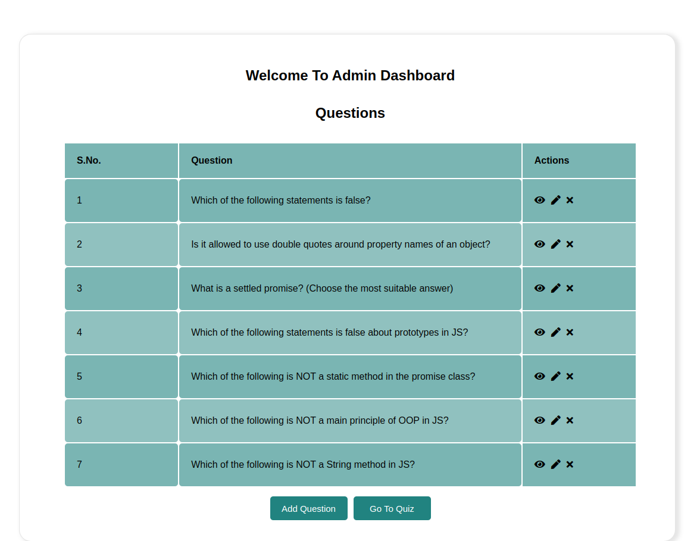
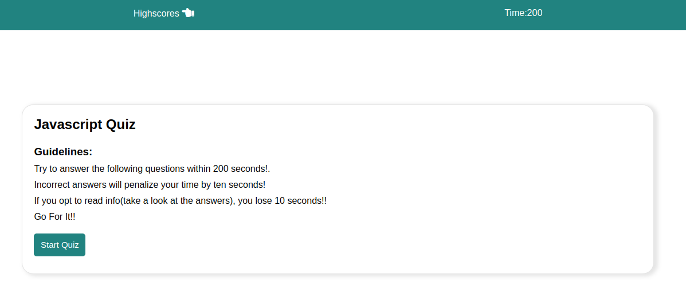

### API (Frontend For JS Quiz App)

### Description :
This is the frontend for my Quiz App. Thid part of the project deals with user participating in the quiz and getting th results.The app lets the user attempt the JS questions and put their knowledge to test. The admins can interact with the app by adding, editing and deleting the questions

### Link to project: https://js-quiz-100devs.netlify.app/admin

### How It's Made:
Tech used: HTML,Vanilla JS, CSS.

I kept the front end quite simple without any frameworks involved. I.e, using Html, Css & Vanilla Js. Backend is built on Node.js using Express.js framework. Mongodb is the database used and querying the database felt really easy and simple.The app lets users attend JS quiz and test their knowledge. The admin section let's them add new questions to the quiz, edit the existing ones and delete them too. The ones who want to enter their scores on scoreboard can opt for that and they can see where they stand among their fellow devs.

### Optimizations
There could be seperate sections for quizes of different languages

### Lessons Learned:
I learnt that I cannot depend on client side data validation. I figured that testing APIs with postman & testing them with JS client needn't produce the same errors!
